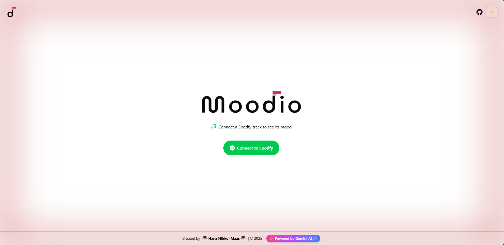

# Moodio

**Moodio** is a **Next.js web app** that analyzes the mood of your Spotify tracks using **Gemini AI** and keeps a history of your music listening. Even though it’s not deployed yet, you can run it locally and explore your music insights.

### Dark

### Light


## Features

- **Music Mood Analysis:** Analyze the mood of your Spotify tracks with Gemini AI.  
- **Listening History:** Keep track of your recently analyzed songs.  
- **AI Insights:** Get emotional insights and color-coded mood feedback for each song.  
- **Clean UI:** Modern and responsive interface built with React and Tailwind CSS.

## Tech Stack

- **Next.js 13+** (App Router)    
- **Supabase** history storage  
- **Spotify API** for fetching user tracks  
- **Gemini AI** for mood analysis    

## Getting Started

### Install Dependencies

```bash
npm install
# or
yarn
# or
pnpm install
```

### Run Development Server

```bash
npm run dev
# or
yarn dev
# or
pnpm dev
```
Open http://localhost:3000 in your browser. The page auto-updates as you edit app/page.tsx.

## Usage

1. Connect your Spotify Account  
2. Play Music in Spotify
3. Let Gemini AI Analyze Your Mood
4. View Mood Insights & Track Recommendations
5. View Your Analysis History

> **Note:** Spotify authentication is required to fetch your tracks.

## Deployment

Once ready, the app can be deployed to **Vercel**.

## Contributing

Contributions and suggestions are welcome!  
Feel free to open **issues** or submit **pull requests**.


Live Soon!
